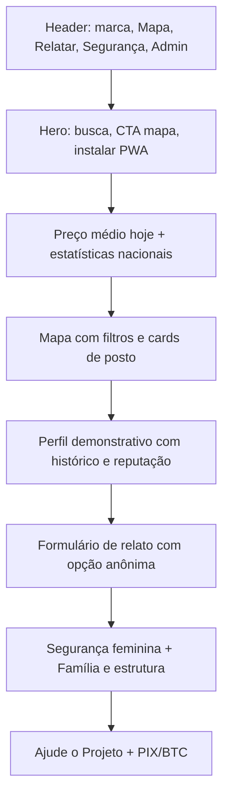
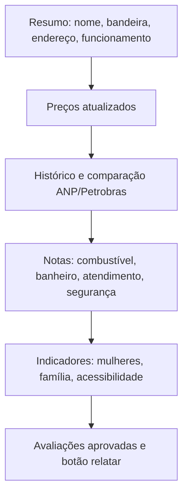
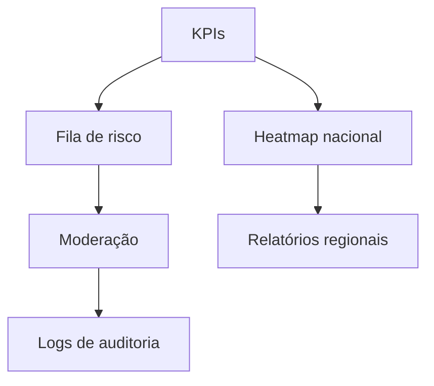

# Wireframes

## Home

```mermaid
flowchart TD
  A["Header: marca, Mapa, Relatar, Segurança, Admin"] --> B["Hero: busca, CTA mapa, instalar PWA"]
  B --> C["Preço médio hoje + estatísticas nacionais"]
  C --> D["Mapa com filtros e cards de posto"]
  D --> E["Perfil demonstrativo com histórico e reputação"]
  E --> F["Formulário de relato com opção anônima"]
  F --> G["Segurança feminina + Família e estrutura"]
  G --> H["Ajude o Projeto + PIX/BTC"]
```

## Perfil do Posto

```mermaid
flowchart TD
  A["Resumo: nome, bandeira, endereço, funcionamento"] --> B["Preços atualizados"]
  B --> C["Histórico e comparação ANP/Petrobras"]
  C --> D["Notas: combustível, banheiro, atendimento, segurança"]
  D --> E["Indicadores: mulheres, família, acessibilidade"]
  E --> F["Avaliações aprovadas e botão relatar"]
```

## Admin

```mermaid
flowchart TD
  A["KPIs"] --> B["Heatmap nacional"]
  A --> C["Fila de risco"]
  C --> D["Moderação"]
  D --> E["Logs de auditoria"]
  B --> F["Relatórios regionais"]
```
